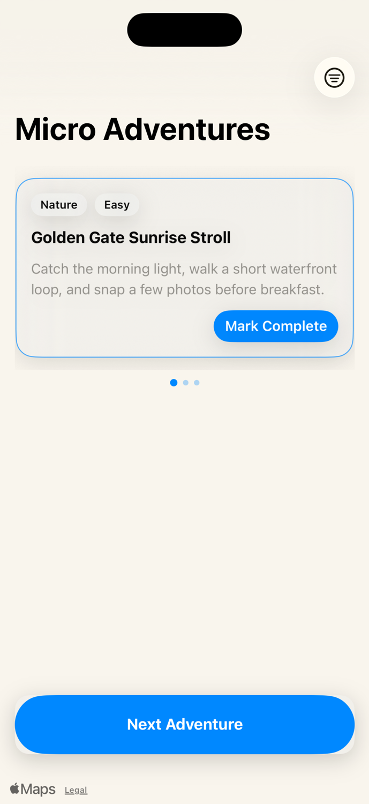
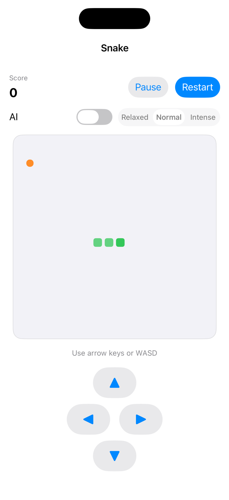

# MicroAdventure

MicroAdventure is a SwiftUI app for discovering quick, local adventures and dropping into a classic Snake mini‑game. Browse ideas on a full‑screen map, skim details in a horizontal card carousel, and jump to a new spot with a single tap.

## Features

- Map‑first discovery with animated camera moves and tappable pins
- Filter adventures by category and effort level, with quick reset controls
- Horizontal card carousel with selection dots and completion state
- “Next Adventure” button to cycle through ideas
- Built‑in Snake game with AI toggle, difficulty levels, and manual override

## Tech Notes

- SwiftUI + MapKit
- Sample data is embedded in `ContentView` for now
- Snake game logic is contained in `SnakeGameLogic` and driven by a timer in `SnakeGameView`

## Screenshots

### Micro Adventures

### Snake Game

